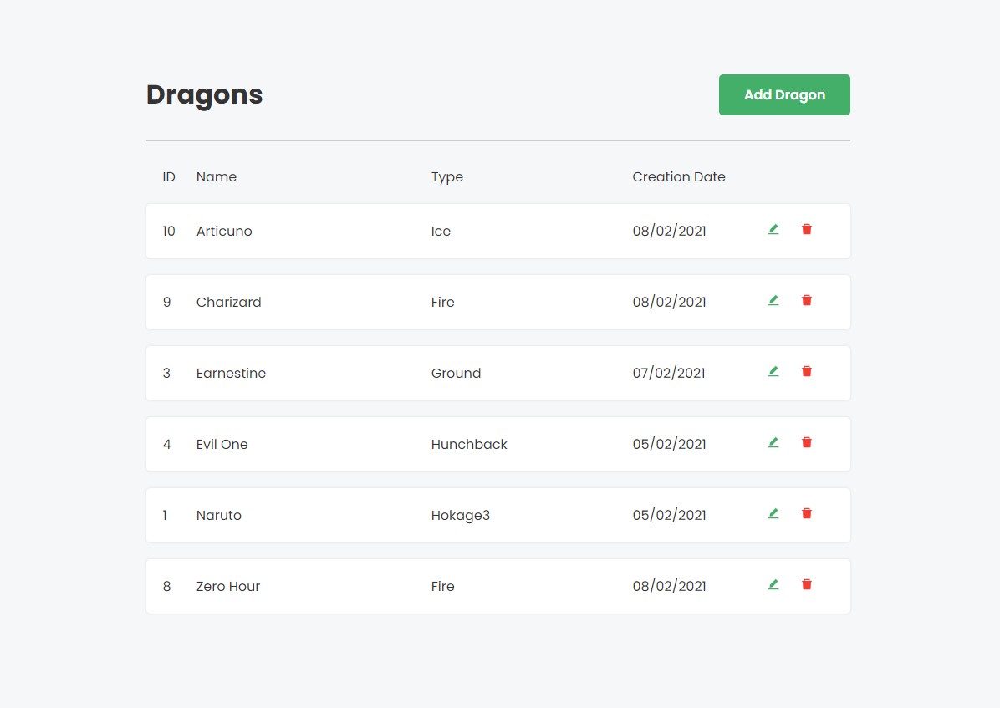

<h2 align="center">
	Front End Challenge
</h2>



## 🚀 Demo
https://elastic-pasteur-49eedf.netlify.app/


## 📙 Overview

As per the [challenge description](https://github.com/rh-southsystem/desafio-front-dragon), the goal of this project was to create a Dragon CRUD application, following the requirements and adding improvements if necessary, besides developing the UI/UX for it ourselves.

## 🔨 Process

First of all, a sketch was drawn on paper, alongside the list of needs and improvements the application could have. Different from my other projects, and since the due time was short, I've decided not to mock it on Figma. In this situation, I chose the components structure, sizes and the application color palette while sketching the layout on paper.

After creating the project using CRA, I added a few Style Guide configs to keep the code consistent, such as ESLint, Prettier and EditorConfig.

For the Frontend, I added the necessary components and pages and filled them with static information. The entire HTML and CSS (Styled Componentss in this case) code was created during this stage, while also paying attention to the UX.

For the logic, I used the Fetch API to pull and update the information needed for the project, React Hooks for the entire state management, and React Router for browsing different pages.

## 🎨 Palette

| Color                            | Hex                             |
| -------------                    |:-------------:                  |
|  | #44af69 |
|  | #ef3e36 |
|  | #FFFFFF |
|  | #f6f7f8 |
|  | #343434 |


## 💾 Getting Started
To build and run this application locally, you'll need latest versions of Git and Node.

```
# Clone this repository
$ https://github.com/msfern/dragon-app

# Go into the repository
$ cd dragon-app

# Install the dependencies
$ npm install 
$ or
$ yarn

# Start the application
$ npm start 
$ or
$ yarn start
```
